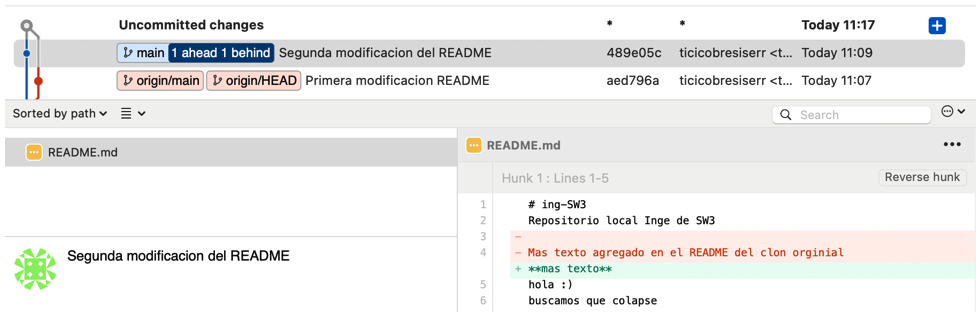

# TP N1

_Trabajo sobre comandos Github_

## Crear un repositorio local y agregar archivos
Crear un repositorio local en un nuevo directorio.
Agregar un archivo Readme.md, agregar algunas líneas con texto a dicho archivo.
Crear un commit y proveer un mensaje descriptivo.

```
git init
git status
git add .
git commit -m 'Readme creado'
```

## Crear un repositorio remoto
Crear una cuenta en https://github.com
Crear un nuevo repositorio en dicha página (vacío)
Asociar el repositorio local creado en el punto 2 al creado en github.
Subir los cambios locales a github.


```
git remote add origin https://github.com/Ticicobresiserr/IngeSW3.git
git branch -M main
git push -u origin main
```

## Familiarizarse con el concepto de Pull Request
Para algunos de los puntos proveer imágenes.
Explicar que es un pull request.
Cuando nos gusta el repositorio de alguien y nos gustaría tenerlo en nuestra cuenta de GitHub, hacemos un fork o bifurcación para poder trabajar con él en forma separada.
Cuando hacemos un fork de un repositorio, obtenemos una instancia de todo el repositorio con todo su historial. Luego, podemos hacer lo que queramos sin afectar la versión original.
Los pull requests son la forma de contribuir a un proyecto grupal o de código abierto.
Por ejemplo, un usuario llamado Harry realiza un fork de un repositorio de ThanoshanMV y le efectúa algunos cambios. Ahora Harry puede hacer un pull request a ThanoshanMV, pero dependerá de ThanoshanMV aceptar o declinarlo. Es como decir: "ThanoshanMV, ¿podrías por favor extraer (pull) mis cambios?"


Crear un branch local y agregar cambios a dicho branch.
```
git checkout -b B2021
nano README.md
git commit -a -m 'Modificacion readme en b2021'
```

Subir el cambio a dicho branch y crear un pull request.
```
git push origin B2021
```
Completar el proceso de revisión en github y mergear el PR al branch master.


## Mergear código con conflictos
Instalar alguna herramienta de comparación. Idealmente una 3-Way:
ByondCompare trial version https://www.scootersoftware.com/download.php
Configurar Tortoise/SourceTree para soportar esta herramienta.
https://www.scootersoftware.com/support.php?zz=kb_vcs
https://medium.com/@robinvanderknaap/using-p4merge-with-tortoisegit-87c1714eb5e2


Clonar en un segundo directorio el repositorio creado en github.
Subir el cambio a dicho branch y crear un pull request.
```
git clone https://github.com/Ticicobresiserr/IngeSW3.git
```
En el clon inicial, modificar el Readme.md agregando más texto.
Hacer commit y subir el cambio a master a github.
```
git commit -a -m 'Primera modificacion README’
git push origin main
```

En el segundo clon también agregar texto, en las mismas líneas que se modificaron el pnanunto anterior.
Intentar subir el cambio, haciendo un commit y push. Mostrar el error que se obtiene.


Hacer pull y mergear el código (solo texto por ahora), mostrar la herramienta de mergeo como luce.



## Resolver los conflictos del código.

```
ing-SW3
Repositorio local Inge de SW3 
<<<<<<< HEAD
**mas texto**
hola :)
buscamos que colapse
=======

Mas texto agregado en el README del clon orginial
>>>>>>> aed796a591103b3760cab581961f1a7782fe18b9
```

foto

```
git config pull.rebase false  # merge (the default strategy)
```

## Explicar las versiones LOCAL, BASE y REMOTE.
LOCAL Es el file en la branch donde estamos haciendo el merge
REMOTE Es el file en la branch desde donde estamos haciendo el merge
BASE no es el ancestro común, sino la fusión a medio terminar donde los conflictos están marcados con >>>>y <<<<.
El código entre <<<< HEAD y los ===== marcadores es el de su archivo local antes de la fusión.
El código entre ====y >>>> <branch name>es el del archivo remoto.
Es decir se toman los cambios de los archivos LOCAL y del REMOTE y se los lleva a un arhcivo BASE, completamente recnstruyendo y tambien reesccribiendo el intento fallido de de merge, que el el archivo MERGE.

